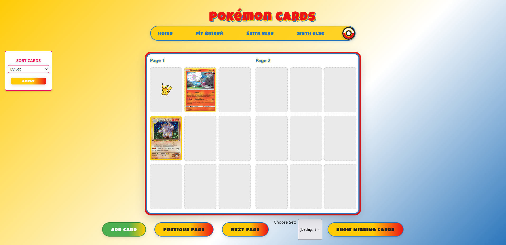

# PokéCollect - A Pokémon Collector App

<!-- TODO: 
- read here: https://github.com/matiassingers/awesome-readme for more good README.md files
- make a gif for website usage (would be cool)
- link website when its all done :)
-->

A modern web app to browse, collect, and filter for Pokémon from all generations. Built with HTML + CSS + JS, powered by Pokemon TCG API.

---

## 📦 Features

- 🔍 **Filter by type, generation, or name**
- 📋 **Track your Pokémon collection**
- Keep track of favorite cards in a binder

---

Built with love and care by Team 20 Vibe Coders  
*We do not debug, we vibe check*  

## Credits

Thank you to [TextStudio](https://www.textstudio.com/) for helping us create our logo.
