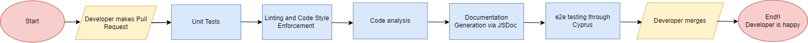

# Phase 1 Status
In this phase, we established the foundation for our CI/CD pipeline with a focus on automation, code quality, and testing. Below is a summary of what has been implemented, what is in progress, and what is planned.

Current pipeline diagram: 

## Linting and code style enforcement
We implemented a linter into the pipeline. This step automatically checks each pull request for styling and syntax consistency. This helps block any merges that fail from entering our workflow

### Functional
- Linter works mostly as intended
- Blocks bad merge calls

### Planned/In Progress
- Might tweak in future based on results
- Need to fix some conflicts with ESLint

## Code quality via tool
We integrated an automated code quality analysis tool into the pipeline using [Codacy](https://www.codacy.com/)

### Functional
- Codacy automates code quality as intended

### Planned/In Progress
- May use branch protection provided by Codacy

## Code quality via human review
We created a Pull Request template to ensure human review of code. Through this, we were able to implement branch protection on the main branch.

### Functional
- Pull request template
- Branch protection on main
- Reviewer section in Pull Request template 

### Planned/In Progress
- TBD

## Unit tests via automation
We used **Jest** to make dummy functions. Through this process, we ensured that the Testing Framework was functional and that GitHub Actions is working.

### Functional
- Dummy functions work as intended
- GitHub Actions functioning
- Testing Framework functioning

### Planned/In Progress
- Replacing dummy functions
- Figuring out testing logic for our project

In phase 2, we will revisit this and replace the dummy functions with relevant tests for our project.

## Documentation generation via automation
We are going to use **JSDoc** to generate documentation from JS code comments and automate this using GitHub Actions.

### Planned/In Progress
- Need to still implement this

## Other testing including e2e 
We used Cypress to start our development for e2e testing. This is currently a work in progress. We will revisit this more during Phase 2.

### Functional
- Set up foundations for e2e testing
- Workflow is functioning 

### Planned/In Progress
- Further develop e2e testing

